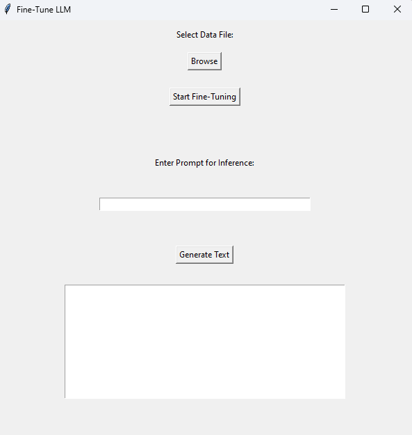

# fine-tune-inference-gui
Cheeky little Tkinter GUI for fine-tuning LLMs - suited for a dev environment. 

**Must** have an **NVIDIA** GPU for CUDA compatibility. 

This tool:
1. Assumes you have enough storage for your fine-tuned LLM as it saves it locally.
2. Can pull from HuggingFace, so you need to have a token for the specified model; this can be configured through the HuggingFace CLI
3. Must be configured directly in the code to change model (unless you want to use GPT-2)

## Features
- Fine-tuning
- Inference

## GUI



## Dependencies
- PyTorch
- Transformers
- Datasets

```
pip install transformers torch datasets
```
Run using:
```
python fine_tune_gui.py
```